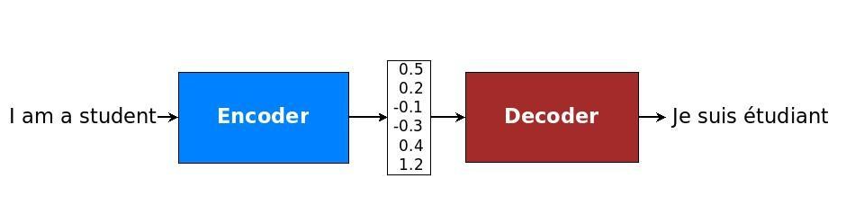

### 머신러닝이란?
- 기계 학습 또는 머신 러닝은 인공 지능의 한 분야로, 컴퓨터가 학습할 수 있도록 하는 알고리즘과 기술을 개발하는 분야이다.
- 기계 학습의 핵심은 표현(데이터 평가)과 일반화(아직 알 수 없는 데이터에 대한 처리)에 있다.(전산 학습 이론 분야이기도 하다.)
- 머신러닝의 분류
  - 지도학습(supervised learning)(분류, 회귀)
    - 기계를 가르친다. 문제와 정답을 비교 하고 맞춘다. 비슷한 문제를 만나면 점점 오답의 확률이 낮아진다.
    - 데이터를 통해서 모델을 생성한다.
    - 지도학습을 위해서는 과거의 데이터가 필요하며 독립변수와 종속 변수가 필요하다. 이를 통해 모델을 생성한다.
    - 분류(classification): 추측하고자 하는 결과가 문자, 이름인 경우 추측(어떤 대상이 어떤 그룹에 속한지 확인)
      - 원핫인코딩: 종속변수(결과값)의 범주형 데이터를 숫자형으로 변경해 주는 작업이다.
    - 회귀(regression): 숫자 예측
    - 학습 과정
      1. 과거의 데이터를 준비 한다.
      2. 모델의 구조를 만든다.
      3. 데이터로 모델을 학습(FIT) 한다.
      4. 모델을 이용 한다.
    - 지도학습 관련 용어
      - 중앙값(가운데의 값): 평균값은 너무 높거나 낮은 값이 많을 경우 평균의 대표성을 무너뜨리는 이상치가 존재한다. 이로인해 평균값보다 중앙값을 사용한다.
      - 퍼셉트론: 다수의 신호를 입력으로 받아 하나의 신호로 출력하는 것이다. 퍼셉트론의 신호란 1(흐른다), 0(안 흐른다) 두가지로 들어온다.
      - 가중치:데이터를 각기 다른 비중으로 전달시키기 위해 웨이트(weight), 비중(가중치)을 다르게 한다라고 이해하면 된다.
      - 편향(bias): 하나의 뉴런으로 입력된 모든 값을 다 더한 다음에(가중합) 이 값에 더 해주는 상수이다. 이 값은 하나의 뉴런에서 활성호 함수를 거쳐 최종적으로 출력되는 값을 조절하는 역활이다.
      - 소프트맥스 함수(Softmax Function): 뉴런의 출력 값을 정규화하는 함수이다. 뉴런의 출력 값에 지수함수를 적용하되 모든 뉴런에서 나온 값으로 정규화하는 형태를 가진다. 그리고 멀티 클래스 분류인 경우 소프트 맥스 함수를 자주 사용한다.
      - 시그모이드 함수(Sigmoide Function): 수치 데이터로 나타낸 가설을 0 또는 1의 데이터로 나타내기 위해 인코딩하는 함수이다.
      - 스위시 함수(Swish Function):  
      - 인풋 레이어(Input Layer): 입력 부분
      - 히든 레이어(Hidden Layer): 인풋, 아웃풋 히든 레이어 사이에 존재한다. 각각의 히든 레이어를 추가하여 더 깊은 인공신경망을 만들 수 있다.
      - 아웃풋 레이어(Output Layer): 출력 부분
  - 비지도학습(unsupervised learning)(군집화, 변환, 연관)
    - 기계에게 데이터 통찰력을 부여한다. 누가 정답을 알려주지 않아도 관찰을 통해 밝혀 낼 수 있다.
    - 독립변수와 종속변수의 구분이 중요하지않고 데이터만 있으면 된다.
    - 군집화(clustering): 비슷한 것들을 찾아서 그룹을 만드는 것이다. 
    - 변환(transform): 데이터를 새롭게 표현하여 사람이나 다른 머신러닝 알고리즘이 원래 데이터보다 쉽게 해석 할 수 있도록 만드는 것이다.
    - 연관(association) 규칙: 서로 관련이 있는 특성을 추천해준다. 쇼핑추천, 영화추천, 검색어추천..등등이 있다. 
  - 강화학습(reinforcement learning)
    - 어떻게 하는것이 더 좋은 결과를 낼 수 있는지 스스로 실력 향상을 위해 노력하는 방법이다. 즉 반복적인 경험을 통해 스스로 성장해 나간다.
    - 상태 > 상/벌 > 관찰 > 강화 > 판단 > 행동 > 변화
    - 환경(environment), 에이전트(agent), 상태(state), 보상(reward), 정책(policy), 행동(action)

#### 모델이란?
- 특정 유형의 패턴을 인식하도록 학습된 파일이다.
- 데이터 세트에 대해 모델을 학습하여 해당 데이터로 추론하고 학습하는데 사용할 수 있는 알고리즘을 제공한다.
- 학습이 잘 되어야 좋은 모델이 나온다.
- 모델을 만드는 과정은 학습이다.

#### 뉴럴 네트워크(Neural Network) - 딥러닝(Deep Learning)
- 사람의 두뇌가 동작하는 방법을 모방해서 기계가 학습을 하도록 하는 알고리즘이다.
- 사람의 두뇌는 뉴런세포들로 연결되어 있는 신경망이 있다. 하지만 기계가 인공적으로 신경망을 만들었기 떄문에 인공신경망이라고 부른다.
- 데이터 간의 연관관계를 찾아내고, 기억하기 위해서 데이터로부터 연관관계를 표현 할 수 있는 특정한 수식을 찾아내는 물건이다.

#### 독립변수와 종속변수
- 독립변수(Independent Variable)
  - 원인
- 종속변수(Dependent Variable)
  - 결과
- 독립변수와 종속변수의 관계는 인과관계라고 한다.
- 인과관계는 상관관계에 포함된다.

---

### 챗봇 머신러닝 요약
- 신경망을 사용하여 자연어처리를 하려면 컴퓨터가 이해할 수 있는 형식으로 변환해야 함
- 가장 쉬운 방법은 One-Hot Encoding을 사용하는 것
- 전체 단어의 수 만큼 벡터의 차원을 만들고 각 단어마다 하나의 차원에 대입

#### 워드 임베딩
1. 0, 1 과 같이 두개의 값이 아니라 0 ~ 1 사이의 벡터값을 가짐.
2. 하나의 단어마다 벡터의 차원을 모두 사용하기에 벡터의 크기를 작게 할 수 있음
3. 비슷한 단어는 벡터의 값이 유사하기 때문에 학습이 더 잘되는 장점이 있음
4. 대표적으로 Word2Vec가 있는데 신경망을 통해 문서 데이터에서 각 단어의 벡터를 학습 가능

- [참고 - Word2Vec](https://dreamgonfly.github.io/blog/word2vec-explained/)
- [참고 - 단어 간 유사도 파악 방법](https://brunch.co.kr/@kakao-it/189)
- [참고 - 자연어 기계학습의 혁명적 진화 - Word2Vec에 대하여](https://www.moreagile.net/2014/11/word2vec.html)

#### 순환 싱경망 RNN(Recurrent Neural Networks)
1. 일반적인 신경망은 피드포워드(feedforward) 방식. 입력에서 출력까지 한쪽 방향만 흐른다.
2. 출력이 다시 입력으로 들어가는것이 특징
3. 이전 출력이 다음번 출력에 영향을 줌
4. 주식, 시계열 데이터, 자연어와 같이 연속적인 상관관계가 있는 분야에서 사용
5. 단 입력 데이터 사이의 거리가 멀어 질 수록 의미를 기억하지 못함
6. 이런 문제를 보완한 것이 LSTM(Long Short Term Memory Networks)

- [참고 - RNN Tutorial](http://aikorea.org/blog/rnn-tutorial-1/)
- [참고 - LSTM 소개](https://brunch.co.kr/@chris-song/9)

#### Seq2Seq(Sequence-to-Sequence)
1. 문장을 그대로 입력 받아서 바로 문장이 출력되도록 하는 방식
2. Encoder와 Decoder 두개의 RNN을 사용하여 구현
3. 단 피자를 주문하거나 물건을 구입하는 등 여러가지 명령어를 수행하는데는 아직 적합하지않음

- [참고 - 문장을 학습하는 딥러닝 RNN의 Seq2Seq 모델 설명](http://aidev.co.kr/chatbotdeeplearning/2273)
- [참고 - 골빈해커님의 Seq2Seq 챗봇](https://github.com/golbin/TensorFlow-Tutorials/tree/master/10%20-%20RNN/ChatBot)

#### Char-CNN 문장의도 파악
1. 보통 챗봇에서 많이 사용하는 방법은 의도와 객체 파악
2. CNN은 대표적으로 이미지 분류에 높은 성능을 보이지만 캐릭터 문자를 처리하는데도 유용
3. 문장을 벡터로 변환하고 특징을 추출한 다음 어떤 의도인지 분류
4. 딥러닝의 장점은 규칙기반과 다르게 복잡한 구문분석 없이도 문장의 의미를 보다 정확하게 파악 가능.

- [참고 - 합성곱 신경망(CNN) 딥러닝을 이용한 한국어 문장 분류](https://docs.likejazz.com/cnn-text-classification-tf/)
- [참고 - CNN으로 문장 분류하기](https://ratsgo.github.io/natural%20language%20processing/2017/03/19/CNN/)
- [참고 - Python과 Tensorflow를 활용한 AI Chatbot 개발 및 실무 적용](https://www.slideshare.net/healess/python-tensorflow-ai-chatbot)
- [참고 - 딥러닝 기반 자연어처리 기법의 최근 연구 동향](https://ratsgo.github.io/natural%20language%20processing/2017/08/16/deepNLP/)

#### RNN으로 개체명 인식 학습
1. NER(Named Entity Recognition)은 문장에서 개체명을 인식하는 것
2. RNN은 문장의 순서에 따라 결과가 다르게 나옴(예. 애플(음식) 파이 와 애플(회사) 컴퓨터)

[출처 - 딥러닝을 사용한 챗봇 개발방법 정리](http://aidev.co.kr/chatbotdeeplearning/3187)

---
### Seq2Seq
- [참고 - 순환신경망을 이해해보자](https://medium.com/humanscape-tech/rnn-recurrent-neural-network-%EC%88%9C%ED%99%98%EC%8B%A0%EA%B2%BD%EB%A7%9D-%EC%9D%84-%EC%9D%B4%ED%95%B4%ED%95%B4%EB%B3%B4%EC%9E%90-1697a5472af2)

#### 정리 1

- 문장을 입력받아 문장을 출력한다. 
- 인코더와 디코더로 이루어져 있다.
- 인코더에서는 전체 입력정보를  순환적으로 처리하여(RNN, LSTM 사용) 히든 스테이트와 셀 스테이트, 즉 상태 값을 저장한다.
- 디코더에서는 해당 정보를 기반으로 OUTPUT을 하나씩 출력한다.
- 인코더로부터 받은 상태값들을 기반으로 <START>을 디코더 첫 입력값으로 입력한다.
- 반드시 <START>가 아니어도 시작을 알리기에 보편적으로 사용할 수 있는, 일반적이지 않아 다른 문자열과 혼동될 문제가 없는 문자열이면 충분하다.
- 디코더에서는 상태값들을(히든 스테이트, 셀 스테이트) 출력하게 된다.
- <START>와 인코더 상태값을 입력했을 때 출력된 출력값을 다시 입력으로 사용한다.
- 이전 상태의 상태값들을 기반으로 다시 신경망을 통과한다.
- <END> 결과가 나오면 순환을 종료한다.
- <START>와 <END>는 모델 학습 수행시 결정해주는 것이다. 다른 구별 문자를 넣어줘도 크게 문제될 것은 없다.
- 실질적으로는 위의 두번째 그림처럼 임베딩된 데이터가 들어가고 소프트맥스 함수로 단어별 확률값이 출력될 것이다.
- [참고 - Seq2Seq](https://inuplace.tistory.com/580)

#### 정리 2

- 인코더는 일반적으로 순환형 인공신경망(RNN - Recurrent Neural Network)으로 구성되어 있다.
- 이 신경망은 입력 문장의 각 단어를 순차적으로 읽어 들여서 문장의 정보를 기억한다.
- 문장의 정보는 벡터의 형태로 저장이 되며, 문장의 입력이 끝나면 디코더가 번역된 문장을 산출하기 시작한다.
- 인코더와 마찬가지로, 디코더는 인코더가 저장한 정보를 바탕으로 번역된 문장의 각 단어를 순차적으로 산출한다.
- 이 방법은 시계열 자료(sequence)를 출력 시계열 자료(sequence)로 매핑(mapping)하기 때문에 Sequence to Sequence 모델이라고 부른다.
- 이 방식의 장점 중 하나는 내가 이 모델의 세부적인 구조를 매우 유연하게 바꿀 수 있다는 점이다.
- 즉, 인코더와 디코더를 실제로 구현할 때, 풀고자 하는 문제에 적합하게 다양한 요소가 고려될 수 있다.
- 인코더는 어떤 순차적 입력에 대한 정보를 기억하기만 하면 될 뿐, 구체적으로 그것을 어떻게, 어떤 구조로 기억하게 만들 것인가는 자유롭게 선택 가능하다.
- 디코더 또한 내가 원하는 정보를 산출하게 만들 것인가도 내가 가진 데이터를 기반으로 자유롭게 구성 가능하다.
- 장점
  - 복잡한 전처리 과정을 생략할 수 있다. 
  - 복잡한 전처리 과정이란 
    1. 사용자가 입력한 대화에 대해 적절한 답을 찾고 
    2. 다양한 가능성을 탐색하고
    3. 특정한 영역 내에서 특수한 목적 달성을 위해 시도하고
    4. 사용자가 어떤 말을 입력할지 예측하는것
  - 모델의 유연성과 단순함 덕분에, 좀 더 복잡한 응답이 요구되는 상황에 따라서 맞춤형 모델을 구성 할 수 있다.
- 단점
  - 사용자가 입력했던 이전의 대화 내용을 기억할 수 없다.
  - 그래서 이러한 단점을 해결할 새로운 방법은 HRED(Hierarchical Recurrent Encoder-Decoder 이다.
  - HRED
    - 비목적성 대화 시스템 개발을 위한 모델이다.
    - 사용자의 이전 입력과 과거 대화 내용을 기억하면서 현재 입력에 대한 응답을 산출하는 모델이다.
    - 인코더 순환형 신경망(사용자가 현재 입력한 내용을 처리), 디코더 순환형 신경망(맥락 RNN이 기억한 정보를 바탕으로 사용자의 입력에 적절한 응답 생성), 맥락 순환형 신경망(사용자의 과거 대화를 기억하는 역할)으로 이루어져 있다.
    - 하지만 이 모델도 한계점을 가지고 있다.
    - 주어진 대화를 보고 다음에 어떤 말이 나올지 예측하는 '정답 찾기'와 같은 방식으로 이루어졌기 때문에, 모델이 산출한대화를 '사람이 보기에 그럴듯함'과는 다소 거리가 있는 경우가 있다.
- [참고 - 딥러닝 기반 챗봇 만들기](https://brunch.co.kr/@trost/22)
