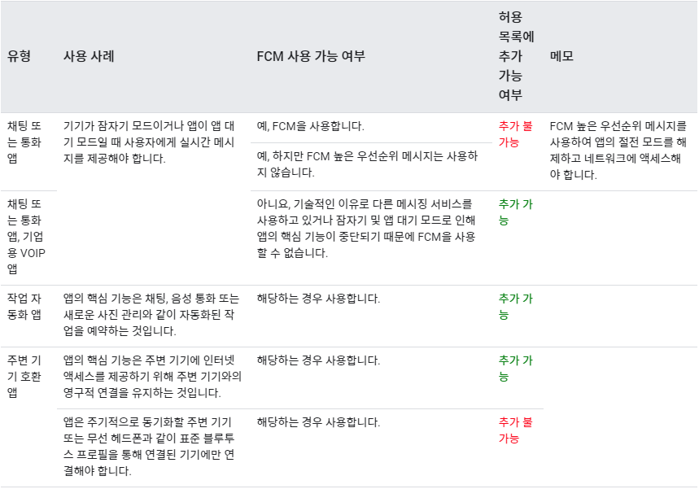

#### DOZE 모드
- 안드로이드 6.0(API 23) 부터 도입되기 시작한 절전 기능이다.
- 이 모드는 기기가 전원에 연결되어 있지 않거나 디바이스를 장기간 사용하지 않았을 경우 배터리 수명을 연장하기 위한 모드.
- 휴대폰 제조사마다 DOZE 모드에 진입하는 시간이 각각 다름. 5분이 걸릴 수도 있고 10분이 걸릴 수도 있고 15분이 걸릴수도 있다.
- OS 버전이 높아 질수록 DOZE 모드에 진입되는 과정이 강화됐다.
(예. 디바이스 화면이 OFF 되어 있고 디바이스가 움직였으면 DOZE 모드에 진입이 안되었는데 OS 버전이 올라간뒤로 디바이스 화면이 OFF 되어 있고 디바이스가 움직여도 DOZE 모드로 진입이 된다.)
- DOZE 모드에 진입하면 백그라운드 작업, CPU 및 네트워크 작업등등이 제한 걸린다.
- DOZE 모드에 진입하게 되면 주기적으로 유지보수 기간이라고 존재하는데 이때만 네트워크 엑세스, CPU 사용, 백그라운드 작업이 허용 된다.
- 유지보수 기간은 DOZE 모드 처음 진입시에는 빠르게 호출이되나 시간이 지나 갈수록 호출되는 주기가 길어짐. 주황색 막대기가 유지보수 기간이다.

- [DOZE 모드 Android Developers 사이트 참고](https://developer.android.com/training/monitoring-device-state/doze-standby?hl=ko)


#### DOZE 모드에서도 동작하는 기능 사례


#### 앱 테스트시 DOZE 강제 진입 방법
1. 앱을 실행
2. ADB Shell 명령어로 강제로 진입 시킴. 명령어는 아래와 같다.

```
C:\>adb shell dumpsys battery unplug

C:\>adb shell dumpsys deviceidle step

해당명령어를 두번정도 반복하여 Stepped to deep:IDLE 상태가 될때까지 반복한다.

```

3. DOZE 모드 해제 방법은 아래와 같다.

```
C:\>adb shell dumpsys battery reset
```

#### 블루투스 앱 개발시 사용했던 방법
해당 앱은 5초마다 앱에서 블루투스를 스캔하여 해당 불루투스 기기가 존재하면 연결을 하여 신호를 보내는 앱 이다.

DOZE 모드의 존재를 파악못하고 개발했을 당시 **죽지않는 서비스**를 이용하여 위의 기능을 구현했다.

하지만 DOZE 모드에 진입하게 되면 서비스는 정상적으로 구동 중이고 블루투스를 스캔까지는 정상적으로 구동가능 하나 블루투스기기와 연결을 하지 못하는 상황이 발생했다.

FCM을 사용하고 싶었지만 FCM 및 서버를 사용할 수 없는 상황이어서 **배터리 제한 해제** 및 **WorkManager** 를 이용하여 해당 부분을 변경하였다.

WorkManager는 15분 마다 한번씩 실행하면서 해당 서비스가 정상적으로 구동중인지 체크 했다. 그리고 배터리 제한 해제는 블루투스 스캔 이후의 작업을 진행하기 위해 사용하였다.

> [WorkManager Android Developers 사이트 참고](https://developer.android.com/topic/libraries/architecture/workmanager/basics?hl=ko)