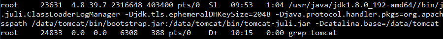
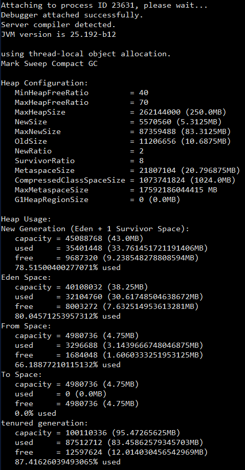
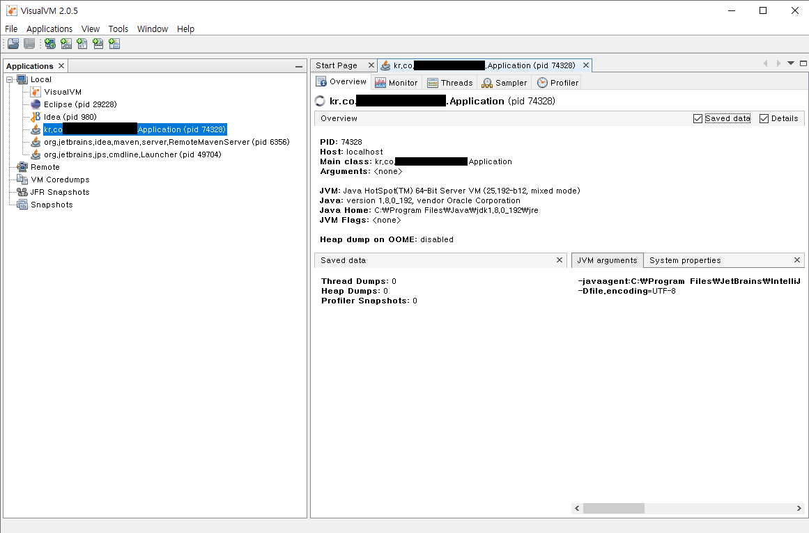

#### 톰캣에서 사용중인 Heap 사이즈 확인
- ps -au|grep tomcat 명령어로 톰캣의 정보를 확인한다.

- jmap -heap [PID] 를 입력하여 JAVA의 힙 메모리 설정을 확인한다.
  (예. tomcat의 PID가 23631 경우 명령어는 jmap -heap 23631)
- MaxHeapSize 를 확인한다. 현재 최대로 설정되어 있는 힙사이즈는 250MB 이다.


#### JAVA Heap 사이즈 초기 설정 규칙

```
  Heap sizes 규칙
  Initial heap size of 1/64 of physical memory up to 1Gbyte
  Maximum heap size of 1/4 of physical memory up to 1Gbyte
  ```

&nbsp;&nbsp;나의 가상머신은 1GB 이므로 최소 Heap 사이즈는 16MB 이고 최대 Heap 사이즈는 250MB 이다.

#### JVM 모니터링 도구 VisualVM
NetBeans 플랫폼을 기반으로 개발된 VisualVM은 JVM을 실시간으로 모니터링하는 GUI 도구이다. 그 외에도 Heap Dump, Thread Dump도 할 수 있으며 여러개의 VM을 동시에 모니터링 및 프로파일링 할 수 있다.

##### 사용방법은

1. [VisualVM 다운로드](https://visualvm.github.io/download.html) 에서 다운로드를 한다.
2. 압축을 해제한 뒤 bin 폴더로 이동 한 뒤 visualvm.exe를 실행 한다.
3. Applications 탭에서 모니터링하고자 하는 목록을 클릭하면 오른쪽(모니터링, 스레드, 샘플러, 프로피일 탭)에서 확인할 수 있다.


##### 각 탭에 대한 설명
- Overview: 사용 옵션 및 자바 버전와 같은 시스템 정보 확인가능하다.
- Monitor: CPU, Memory, Classes, Threads 등을 볼 수 있다.
- Threads: 현재 Threads의 상태를 확인 가능하다.
- Sampler: CPU, Memory를 샘플링 할 수 있다. 즉, JVM의 일정 주기로 스레드 덤프를 통해서 성능을 측정하고 성능 측정에 영향을 거의 주지 않는다. 하지만 일정 주기로 스레드 덤프가 호출 되기 때문에 호출 횟수를 잃어버리는 경우가 생겨 정확하지 않다.
- Profiler: CPU, Memory 프로파일링을 할 수 있다. 즉, 어플리케이션 전체 혹은 몇몇 클래스의 성능을 측정 할 수 있고 알고리즘 최적화나 호출 횟수 측정하기에 용이하다.그리고 Profiler 에 의해 자동적으로 생성된 코드가 성능 측정에 어느정도 영향을 줄 수 있다.

#### 패턴
- Table Data GateWay 패턴: 테이블 별로 하나의 DAO를 만든다.
- Separated Interface 패턴: DIP(Dependency Inversion Principle)에 기반하여 인터페이스와 구현부 사이의 계층을 분리하는 패턴
- Transition Script 패턴: 하나의 트랜잭션으로 구성된 로직을 단일 함수 또는 단일 스크립트에서 처리하는 구조이다.
- Facade 패턴: 복잡한 서브시스템을 인터페이스로 감싸 간단하게 만드는 것이다. 클라이언트는 서브시스템의 존재를 모르고 오직 Facade 클래스만 알고 있고 Facade 클래스만 접근 할 수 있다.
- CQRS(Command and Query Responsibility Segregation) 패턴: 명령(command, 업데이트) 및 쿼리(query, 읽기)의 책임을 분리하는 패턴이다. 성능 및 확장성 보안을 극대화 할 수 있다.

#### DAO vs Repository
- DAO
  - Transaction Script 패턴과 함께 사용된다.
  - 퍼시스턴스 레이어에 속한다.
  - 데이터베이스의 CRUD 쿼리와 1:1 매칭되는 세밀한 단위의 오퍼레이션을 제공한다.
  - Dao에서 제공하는 오퍼레이션이 Repository가 제공하는 오퍼레이션보다 더 세밀하다.
  - 데이터베이스 뿐만 아니라 B2B, LDAP, 메인 프레임, 레거시 시스템등 다양한 종류의 외부 시스템과의 상호작용을 캡슐화하기 위해 사용 될 수 있다.
  - 퍼시스턴스 로직의 요구사항에 따라 설계된다.
- Repository
  - Domain Model 패턴과 함께 사용 된다.
  - 도메인 레이어에 속한다.
  - 메모리에 로드된 객체 컬렉션에 대한 집합 처리를 위한 인터페이스를 제공한다.
  - Repository에서 제공하는 하나의 오퍼레이션이 DAO의 여러 오퍼레이션에 매핑되는 것이 일반적이다.
  - 하나의 Repository 내부에서 다수의 Dao를 호출하는 방식으로 구현할 수 있다.
  - 외부 시스템과의 상호작용은 별도의 Service 가 담당한다.
  - 도메인의 요구사항에 따라 설계 된다.

#### DDD Start 도서 정리
- 도메인은 여러개의 하위 도메인을 가질 수 있다. 
- 도메인에 따라 용어의 의미가 결정된다.
- 여러 하위도메인을 하나의 다이어그램에 모델링하면 안된다. 이는 도메인을 이해하는데 방해가 된다.
- 도메인 모델 패턴
  |계층|설명|
  |----|----|
  |표현|사용자의 요청 처리 및 사용자에게 정보를 보여준다.|
  |응용|사용자가 요청한 기능을 실행한다. 업무로직을 직접 구현하지 않고 도메인 계층을 조합해서 기능을 실행한다.|
  |도메인|시스템이 제공할 도메인 규칙을 구현한다.|
  |인프라스트럭처|데이터베이스나 메시징 시스템과 같은 외부 시스템과의 연동을 처리한다.|

- 개념 모델: 순수하게 문제를 분석한 결과물이다. 이 모델은 데이터베이스, 트랜잭션 처리, 성능, 구현 기술등등과 같은 것을 고려하지 않기 때문에 실제 코드를 작성할 때는 개념 모델을 있는 그대로 사용할 수 없다. 그래서 개념 모델을 구현 가능한 형태의 모델로 전황하는 과정이 필요하다.
- 구현 모델: 구현하는 과정에서 개념 모델을 개발하면서 점차 발전해 나가는 모델의 형태(?)

- 도메인을 모델링할 때 기본이 되는 작업은 모델을 구성하는 핵심 구성요소, 규칙 기능을 찾는 것이다.
- 엔티티: 식별자를 갖는 객체이다. 식별자의 종류에는 특정 규칙에 따라 생성, UUID, 값을 직접 입력, 일련번호 사용(시퀀스나 DB의 자동증가 컬럼) 등이 있다.
- 밸류타입: 개념적을 완전한 하나를 표현 할 때 사용한다. 그리고 불변으로 구현하는 것을 권장한다.
- 도메인 모델에 set 메서드 넣지 않기.
- DIP(Dependency Inversion Principle, 의존 역전 원칙): 고수준의 모듈의 테스트를 하려면 저수준의 모듈에 의존해야 되는데 이렇게 될 경우 구현변경과 테스트의 어려움이 있다. 이를 해결하기위해 저수준의 모듈이 고수준의 모듈을 의존하도록 한다.
- 애그리거트(AGGREGATE): 애그리거트는 관련된 엔티티와 밸류 객체를 개념적으로 하나로 묶은 것이다. 도메인 모델에서 전체 구조를 이해하는데 도움이 된다.
- 리포지터리(REPOSITORY): 도메인 모델의 영속성을 처리한다.
- 도메인 서비스(DOMAIN SERVICE): 특정 엔티티에 속하지 않은 도메인 로직을 제공한다.
- 도메인 모델의 엔티티: 데이터와 함께 도메인 기능을 함께 제공한다. 예를 들어, 주문을 표현하는 엔티티는 주문과 관련된 데이터 뿐만 아니라 배송지 주소 변경을 위한 기능도 함께 제공한다. 그리고 두 개 이상의 데이터가 개념적으로 하나인 경우 밸류 타입을 이용해서 표현 할 수 있다.
- DB의 엔티티: 밸류 타입을 제대로 표현하기 힘들다. 단순하게 데이터를 담고 있다.
- 애그리거트
  - 애그리거트 루트: 애그리커드에 속한 모든 객체가 일관된 상태를 유지하려면 애그리커트 전체를 관리 할 주체가 필요한데 이 책임을 지는 것이 애그리거트의 루트 엔티티이다.
  - 애그리거트와 리포지터리: 에그리거트 루트안에 속하는 기능들은 오직 에그리거트 루트를 위한 리포지터리만 존재해야 한다. 애그리거트는 개념적으로 하나이므로 리포지터리는 애그리거트 전체를 저장소에 영속화 해야 한다.
  - 애그리거트에서 루트 엔티티를 뺀 나머지 구성요소는 대부분 벨류이다. 루트 엔티티 외에 또 ㅏㄷ른 엔티티가 있다면 진짜 엔티티인지 의심해봐야 한다. 단지 별도 테이블에 데이터를 저장한다고 해서 엔티티인 것은 아니다.
  - 애그리거트에 속한 객체가 밸류인지 엔티티인지 구분하는 방법은 고유 식별자를 갖는지 여부를 확인한다. 별도 테이블로 저장되고 테이블에 PK가 있다고 해서 테이블과 매핑되는 애그리거트 구성요소가 고유 식별자를 갖는 것은 아니다.
  - 애그리거트는 개념적으로 하나여야 한다. 하지만 루트 엔티티를 로딩하는 시점에 애그리거트에 속한 객체를 모두 로딩해야 하는것은 아니다.
  - 애그리거트가 완전해야 하는 이유는 두가지 정도가 있다.
    - 첫 번째. 상태를 변경하는 기능을 실행 할때 애그리거트 상태가 완전해야 한다.
    - 두 번째. 표현 영역에서 애그리거트의 상태 정보를 보여줄 때 필요하다. 하지만 조회 전용 기능을 구현하는 방식을 사용하는 것이 유리할때가 많기 때문에 완전한 상태로 로딩할 필요는 없다.
  - 애그리거트의 영속성 전파
    - 저장할때 애그리거트에 속한 모든 객체를 저장해야 한다.
    - 삭제할때 애그리거트 루트 뿐만 아니라 애그리거트에 속한 모든 객체를 삭제 해야 한다.
  - 스펙: 애그리거트가 특정 조건을 충족하는지 여부를 검사하는 것이다.
- 응용서비스: 클라이언트가 요청하는 기능을 실행한다. 클라이언트의 요청을 처리하기 위해 리포지터리로부터 도메인 객체를 구하고, 도메인 객체를 사용한다. 즉 클라이언트 입장에서 보았을때 응용 서비스는 도메인 영역과 표현 영역을 연결해주는 창구인 Facade 역할을 한다. 그리고 도메인의 상태를 변경하는 트랜잭션 처리를 한다.
  - 응용서비스는 복잡한 로직을 처리 하지 않는다. 만약 복잡한 로직을 처리한다면 도메인 영역의 로직을 응용서비스에서 구현하였는지 확인한다.
  - 구분되는 기능별로 서비스 클래스를 구현한다.(2~3개의 기능 정도가 구현 된다.) 해당 방식을 사용하면 클래스 개수는 많아지지만 한 클래스에 관련 기능을 모두 구현하는 것과 비교해서 코드 품질을 일정 수준으로 유지하는데 도움이 된다.
  - 각 서비스마다 동일한 로직을 구현할 경우 별로 클래스에 로직을 구현해서 코드가 중복되는 것을 방지 한다.(Helper 클래스 등등..)
  - 서비스 생성시 인터페이스를 꼭 생성해야 하는가? 라는 의문이 발생하게 되는데 꼭 생성할 필요는 없다. 인터페이스가 필요한 경우는 몇가지가 있는데 그 중하나가 구현 클래스가 여러개인 경우 혹은 런타임에 구현 객체를 교체해야 할 경우에 유용하다.
  - 응용서비스의 파라미터 타입을 결정할 때 주의할 점은 표현 영역과 관련된 타입을 사용하면 안된다. 예를 들어 HttpServletRequest 나 HttpSession이 있다. 표현 영역의 파라미터 타입을 사용하면 응용서비스 단독 테스트가 어려워지고 표현 영역과 의존성이 생겨 표현 영역이 변경되면 응용서비스의 구현 또한 변경되어야 한다.
  - 트랜잭션을 처리한다.
  - 도메인 영역에서 발생시킨 이벤트를 처리한다. 이벤트로 처리하는 이유는 코드가 복잡해지기는 하나 도메인 간의 의존성이나 외부 시스템에 대한 의존을 낮춰주는 장점을 얻을 수 있다.
- 표현 영역
  - 단순하게 조회만 호출하는 응용서비스가 존재할 경우 표현 영역에서 DAO 혹은 Repository 를 호출해도 무방하다.
  - 표현 영역의 책임
    - 사용자가 시스템을 사용할 수 있는(화면) 흐름을 제공하고 제어한다.
    - 사용자의 요청을 알맞은 응용 서비스에 전달하고 결과를 사용자에게 제공한다.
    - 사용자의 세션을 관리한다.
  - 값 검증
    - 표현 영역: 필수 값, 값의 형식, 범위 등을 검증한다.
    - 용용 서비스: 데이터의 존재 유무와 같은 논리적 오류를 검증한다.
  - 권한 검사
    - 스프링 시큐리티 혹은 아파치 Shiro 와 같은 프레임워크를 사용하거나 스프링을 서블릿 필터를 사용 한다.
- 도메인 서비스
  - 다른 애그리거트를 참조하거나 다른 애그리거트에 의존성이 높아지면서 해당 애그리거트의 로직이 많아진다면 해당 애그릐거트는 자신의 책임 범위를 넘어서게 된다. 이런 문제를 해소하기 위해 도메인 서비스를 별도로 구현 한다.
  - 도메인 서비스를 구현 할때는 상태 없이 로직만 구현 한다. 도메인 서비스를 구현하는데 필요한 상태는 애그리거트나 다른 방법으로 전달 받는다.
  - 도메인 로직을 구현 할때는 도메인의 의미가 드러나는 용어를 타입과 메서드 이름으로 갖는다.
  - 애그리거트 객체에 도메인 서비스를 전달하는 것은 응용 서비스 책임이다.
  - 도메인 서비스 객체를 애그리거트에 스프링의 DI, AOP 등을 이용하여 의존성을 주입하지 않고, 애그리거트 메소드에서 파라미터로 도메인 서비스를 받는다. 그 이유는 해당 도메인 객체의 기능이 도메인 서비스의 모든 기능을 사용하지 않기 때문이다.
  - 애그리거트 메서드를 실행할 때 도메인 서비스를 인자로 전달하지 않고 반대로 도메인 서비스의 기능을 실행할 때 애그리거트를 전달하기도 한다.(예. 계좌이체 서비스)
  - 특정 기능이 응용 서비스인지 도메인 서비스인지 감을 잡기 어려울 때는 해당 로직이 애그리거트의 상태를 변경하거나 애그리거트의 상태 값을 계산하는지 검사해 보면된다.
  - 도메인 서비스의 패키지 위치는 도메인 패키지안에 위치하면 된다.
- 애그리거트 트랜잭션 관리
  - 선점(Pessimistic)잠금(비관적 잠금)
    - 먼저 애그리거트를 구한스레드가 애그리거트 사용이 끝날 때까지 다른 스레드가 해당 애그리거트를 수정하는 것을 막는 방식이다.
    - 한 스레드가 애그리거트를 구하고 수정하는 동안 다른 스레드가 수정할 수 없으므로 동시에 애그리거트를 수정할 때 발생하는 데이터 충돌 문제를 해소할 수 있다.
    - 선점잠금은 보통 DBMS가 제공하는 행 단위 잠금을 사용해서 구현 한다. 오라클을 비롯한 다수 DBMS가 for update와 같은 쿼리를 사용해서 특정 레코드에 한 사용자만 접근할 수 있는 잠금 장치를 제공한다.
    - JPA의 EntityManager는 LockModeType을 인자로 받는 find() 메서드를 제공하는데, LockModeType.PESSIMISTIC_WRITE를 값으로 전달하면 해당 엔티티와 매핑된 테이블을 이용해서 선점 잠금 방식을 적용 할 수 있다.
    - 선점 잠금 기능을 사용할 때는 잠금 순서에 따른 교착 상태(DeadLock)가 발생하지 않도록 주의해야 한다.
    
    ```
    선점 잠금 기능에 대한 교착 상태 예시.
    1. 스레드1: A 애그리거트에 대한 선점 잠금 구함
    2. 스레드2: B 애그리거트에 대한 선점 잠금 구함
    3. 스데르1: B 애그리거트에 대한 선점 잠금 시도
    4. 스레드2: A 애그리거트에 대한 선점 잠금 시도
    ```
    - 이런 문제가 발생하지 않도록 하려면 잠금을 구할 때 최대 대기 시간을 지정해야 한다. JPA에서는 선점 잠금을 시도할 때 최대 대기 시간을 지정하려면 힌트를 사용 하면 된다.(javax.persistence.lock.timeout) 이를 사용 할때 주의할 점은 DBMS에 따라 힌트가 적용되지 않을 수 있다.
  - 비선점(Optmisitic)잠금(낙관적 잠금)
    - 잠금을 해서 동시에 접근하는 것을 막는 대신 변경한 데이터를 실제 DBMS에 반영하는 시점에 변경 가능 여부를 확인하는 방식이다.
    - 비선점 잠금을 구현하려면 애그리거트에 버전으로 사용할 숫자 타입의 프로퍼티를 추가해야 한다. 애그리거트를 수정할 때마다 버전으로 사용할 프로퍼티의 값이 1씩 증가한다. 이 쿼리는 수정할 애그리거트와 매피되는 테이블의 버전 값이 현재 애그리거트의 버전과 동일한 경우에만 데이터를 수정한다. 그리고 수정에 성공하면 버전 값을 1 증가 시킨다.
    - JPA에서도 비선점 잠금을 지원하는데 버전으로 사용할 필드에 @Version 애노테이션을 붙이고 매핑되는 테이블에 버전을 저장할 컬럼을 추가하면 된다.
    - 강제 버전 증가
      - 애그리거트에 애그리거트 루트 외에 다른 엔티티가 존재할 경우  다른 엔티티의 값만 변경 될 경우 애그리거트 루트의 버전은 그대로 이다. 이때 JPA에서 find를 통해서 애그리거트 루트 엔티티를 가져올 때 버전을 증가 시킬 수 있는데 이는 비선점 강제 버전증가 잠금인 LockModeType.OPTIMISTIC_FORCE_INCREMENT 옵션을 사용하면된다.
  - 오프라인 선점 잠금
    - 누군가 수정 화면을 보고 있을때 수정 화면 자체를 실행하지 못하도록 해야하는 것이 오프라인 선점 잠금 방식 이다.
    - 오프라인 선점 잠금은 여러 트랜잭션에 걸쳐 동시 변경을 막는다.
    - 오프라인 선점 잠금은 첫 번째 사용자가 락을 건 후 락을 해지하지 않고 나가버리면 다음 사용자가 사용을 하지 못하기 때문에 락에 대한 유효 시간이 필요하다.
    - 오프라인 선점 잠금은 크게 잠금 선점 시도, 잠금 확인, 잠금 해제, 락 유효 시간 연장 네가지 기능을 제공한다.
  - Bounded Context
    - 하위 도메인마다 같은 용어라도 의미가 다르고 같은 대상이라도 지칭하는 용어가 다를 수 있다. 그러므로 한 개의 모델로 모든 하위 도메인을 표현하려는 시도는 올바른 방법이 아니며 표현할 수도 없다. 하위 도메인마다 사용하는 용어가 다르기 때문에 올바른 도메인 모델을 개발하려면 하위 도메인마다 모델을 만들어야 한다. 각 모델은 명시적으로 구분되는 경계를 가져서 섞이지 않도록 해야 한다. 이렇게 같은 회원이라도 배송, 주문, 회원 도메인마다 회원이라는 의미가 서로 다르다. 이렇게 구분되는 경계를 갖는 컨텍스트를 Bounded Context 라고 부른다.
    - Bounded Context는 도메인 모델만 포함하는것은 아니다. 도메인 모델뿐만 아니라 도메인 기능을 사용자에게 제공하는 데 필요한 표현 영역, 응용 서비스, 인프라 영역 등을 모두 포함 한다. 도메인 모델의 데이터 구조가 바뀌면 DB 테이블 스키마도 함께 변경해야 하므로 해당 테이블도 포함 된다.
    - 모든 Bounded Context는 반드시 도메인 주도로 개발할 필요는 없다.
    - 한 Bounded Context에서 두 방식을 혼합해서 사용할 수도 있다. 대표적인 예가 CQRS 패턴이다. CQRS 는 Command Query Responsibility Segregation의 약자로 상태를 변경하는 명령 기능과 내용을 조회하는 쿼리 기능을 위한 모델을 구분하는 패턴이다.
    - Bounded Context는 UI를 가지지 않을 수도 있다.
    - Bounded Context는 서로 다른 구현 기술을 가질 수도 있다.
    - Bounded Context 간 관계
      - Bounded Context는 어떤 식으로든연결된다. 그래서다양한 방식으로 관계를 맺는다. 그 중 가장 흔한 관계는 한쪽에서 API 를 제공하고 다른 한쪽에서는 그 API를 호출하는 관계이다.
      - 공개 호스트 서비스
        - 상류 팀의 고객인 하류 팀이 다수 존재하면 상류 팀은 여러 하류 팀의 요구사항을 수용할 수 있는 API를 만들고 이를 서비스 형태로 공개해서 서비스의 일관성을 유지 한다. 이런 서비스를 가리켜 공개 호스트 서비스 라고 한다.
        - 대표적인 예가 검색이다.
    - 상류 컴포넌트의 서비스는 상류 Bounded Context의 도메인 모델을 따른다. 따라서 하류 컴포넌트는 사율 서비스의 모델이 자신의 도메인 모델에 영향을 주지 않도록 보호해 주는 완충 지대를 만들어야 한다. 이렇게 외부 시스템과의 연동을 처리하는데 외부 시스템의 도메인 모델이 내 도메인 모델을 침범하지 않도록 막아주는 역할을 하는것이 안티코럽션 계층(Anticorruption Layer)이 된다.
    - 두 Bounded Context가 같은 모델을 공유하는 경우도 있는데 이렇게 공유하는 모델을 공유 커널(Shared Kernel)이라고 부른다.
    - 두 Bounded Context 간에 통합을 하지 않을 때는 독립 방식(Separate Way) 관계이다.
    - 개별 Bounded Context 에 매몰되면 전체를 보지 못할 때가 있다. 나무만 보고 숲을 보지 못하는 상황을 방지하려면 전체 비즈니스를 조망할 수 있는 지도가 필요한데, 그것이 바로 컨텍스트 맵이다. 컨텍스트 맵은 Bounded Context 간의 관계를 표시한 것이다.
    - 컨텍스트 맵은 시스템의 전체 구조를 보여 준다.
  - 이벤트
    - 쇼핑몰에서 구매를 취소하면 환불을 처리해아 한다. 이때 환불 기능을 실행하는 주체는 주문 도메인 엔티티가 될 수 있지만 도메인 객체에서 환불 기능을 실행하려면 환불 기능을 제공하는 도메인 서비스를 파라미터로 전달받고 취소 도메인 기능에서도메인 서비스를 실행해야 되기 때문에 도메인 간에 강한 결합이 생기는 문제가 발생한다.
    - 여러 도메인을 호출하고 외부 시스템 연동까지 곂치게되면 트랜잭션 처리 및 외부 호출 시간이 오래 걸린다면 이 또한 문제가 발생할 수 있다.
    - 이렇게 도메인 간에 강한 결합(High Coupling)을 해결하기 위해 이벤트를 사용하게 된다. 특히 비동기 이벤트를 사용하면 여러 도메인 혹은 시스템간에 결합을 크게 낮출 수 있다.
    - 이벤트 관련 구성 요소는 '이벤트 생성 주체' ---이벤트---> '이벤트 디스패처(이벤트 퍼블리셔) ---이벤트---> 이벤트 핸들러(이벤트 구독자) 이다.
      - 이벤트 주체: 엔티티, 밸류, 도메인 서비스와 같은 도메인 객체이다.
      - 이벤트 핸들러: 이벤트 생성 주체가 발생하 ㄴ이벤트에 반응 한다.
      - 이벤트 디스패처: 이벤트 생성 주체와 이벤트 핸들러를 연결해 준다.
    - 이벤트의 구성
      - 이벤트 종류: 클래스 이름으로 이벤트 종류를 표현
      - 이벤트 발생 시간
      - 추가 데이터: 주문번호, 신규 배송지 정보 등에 대한 이벤트 관련 정보
    - 이벤트 용도
      - 트리거의 용도: 도메인의 상태가 바뀔 때 다른 후처리를 해야 할 경우 후처리를 실행하귀 위한 트리거로 이벤트를 사용한다. 
  - CQRS(Command Query Responsibility Segregaion)
    - 단일 모델의 단점: 여러 애그리거트를 조회해서 모델을 만들때 기존 ORM 기법을 사용하면 도메인의 상태 변경을 구현하는데는 적합하지만, 여러 애그리거트를 조회해서 모델을 만들때는 고려해야 할 것들이 너무 많고 복잡해지는 원인이 된다. 그리고 경우에 따라서 DBMS가 제공하는 전용 기능을 이용해서 조회 쿼리를 작성해야하는 경우가 있다.
    - 단일 모델을 사용할 때 발생하는 복잡도를 해결하기 위해 사용 하는 방법이 바로 CQRS 이다.
    - 시스템이 제공하는 기능을 명령과 조회로 구분한다.
      - 상태를 변경하는 기능: 명령(Command)
      - 상태 정보를 조회하는 기능: 조회(Query)
    - 장점
      - 도메인 자체에 집중 할 수 있다. 즉 복잡도가 낮아진다.
      - 조회 성능을 향상시키는 데 유리하다.
    - 단점
      - 구현해야 할 코드가 많다.
      - 더 많은 구현 기술이 필요하다.

#### JPA
- OneToMany, ManyToOne 양방향 조인시 Outer Join 과 Inner Join
  - Outer Join인 경우: ManyToOne 이 연관관계 주인에서 ManyToOne(optional = true) 혹은 @JoinColumn(name = "...", nullable = true)
    이와 같이 설정할 경우 Many 에서 One 이 없을 수도 있다라는 설정이다.
  - Inner Join인 경우: ManyToOne 이 연관관계 주인에서 ManyToOne(optional = false) 혹은 @JoinColumn(name = "...", nullable = false)
    이와 같이 설정할 경우 Many 에서 One 이 무조건 있다라는 설정이다.
  - 참고: optional 과 nullable 의 기본값은 true 이다.
- Fetch Type 
  - 하나의 Entity를 조회 할 때, 연관관계에 있는 객체들을 어떻게 가져올 것이냐를 설정하는 값이다.
  - Lazy: 연관 관계의 Entity를 가져오지 않고, 실제 사용(getter) 할 때 가져온다.
    - 연관 관계 기본 Fetch Type: OneToMany, ManyToMany
  - Eager: 연관 관계에 있는 Entity를 모두 가져온다.
    - 연관 관계 기본 Fetch Type: ManyToOne, OneToOne
- N + 1 이란? 
  - OneToMany 및 ManyToOne 양방향 관계에서 OneToMany 에서 findAll 조회시 Many 부분에서 One 의 조회 갯수 만큼
  Many의 부분을 가져오기 위해 여러번 쿼리가 날아가는 현상
  - JPQL을 실행하면 JPA가 이를 분석하여 SQL을 생성한다. JPQL 입장에서는 즉시 로딩(Eager), 지연 로딩(Lazy) 같은
  글로벌 패치 전략을 무시하고 JPQL 만 사용해서 SQL을 생성한다.
  - JPQL 은 특징이 있다.
    - findById 메소드: 엔티티를 영속성 컨텍스트에서 먼저 찾고 영속성 컨텍스트에 없는 경우 데이터베이스에서 찾는다.
    - findAll 메소드: 항상 데이터베이스에 SQL 을 실행하여 결과를 조회한다. 
      1. JPQL 을 호출하면 데이터베이스에 우선 적으로 조회한다.
      2. 조회한 값을 영속성 컨텍스트에 저장한다.
      3. 영속성 컨텍스트에 조회 할 때 이미 데이터가 존재한다면 데이터를 버린다.
  - N + 1을 피하려면?
    - OneToMany에서 Many 변수 부분에 BatchSize 어노테이션 추가 혹은 JPA 글로벌 설정으로 BatchSize 추가
      BatchSize를 추가하면 Many 조회시 SQL 하나하나 실행하는것이 아니라 WHERE IN 절로 설정한 Size 만큼 가져온다.

```
- 클래스의 변수에 추가
@BatchSize(size = 5)
@OneToManay(mappedBy = "member")
private List<String>> valueList = new LinkedList<>();

- 스프링에서 글로벌 설정(yml 설정)
spring:
  jpa: 
    properties:
      default_batch_fetch_size: 1000
```

    - fetch join 을 사용하여 연관관계의 데이터도 함께 조회한다.
      - fetch join 은 두개 이상의 테이블(Collection 자료형)에 사용 할 수 없고, Pageable을 사용 할 수 없다.
      - fetch join 에서 두개 이상의 테이블(Collection 자료형)에서 사용하려면 자료형을 Set으로 변경하면된다.
      - fetch join 은 ManyToOne 와 OneToOne 은 여러번 사용 가능하다.
      - fetch join 사용시 Pageable을 파라미터로 넘겨 받아도 limit 와 offset 과 관려된 쿼리문은 없다.
        그러므로 모든 데이터를 메모리에 올린 후  페이징을 처리하기 때문에 메모리 이슈가 발생할 수 있다.
        이를 해결하기 위해서는 @BatchSize 와 즉시 로딩을 이용하면 회피 할 수 있다.
        적절하게 fetch join과 BatchSize를 이용해서 성능을 최적화 해야 한다.
    - JPA Repository 메소드에 @EntityGraph 어노테이션을 사용한다.

- 벌크 연산(여러건의 데이터를 한번에 수정하거나 삭제하는 방법)을 할 경우 영속성 컨텍스트와 2차 캐시를 무시하고 데이터베이스에 직접 쿼리를 실행한다. 조회 후 벌크 연산을 할 경우 영속성 컨텍스트에 있는 정보와 데이터베이스의 정보가 다를 수 있다. 이를 해결하는 방법은
  1. em.refresh() 사용
  2. 벌크 연산 우선 실행
  3. 벌크 연산 후 영속성 컨텍스트 초기화(벌크 연산 쿼리문에 clearAutomatically 기능을 통해 사용)
- 엔티티가 영속상태가 되려면 식별자가 필요하다. Insert 할 때 식별자를 구하기 위해, 영속화 되기 위해 트랜잭션 커밋 전에 즉시 데이터를 데이터베이스에 전달하고 영속상태가 된다.
- 식별자 Select > Update 할때는 트랜잭션이 커밋이 되야 Update 문이 데이터베이스에서 실행된다.
- 식별자 Select > Update > 식별자가 아닌 필드 조회를 할 경우 Update문은 트랜잭션 커밋이 되기 전에 실행되지 않고 필드 조회 하기 전에 쓰기지연 저장소에 있던 Update 쿼리가 실행 되고 실행 된다. 그리고 트랜잭션 Lsolation Level을 낮춰도 동일하게 작동된다.
- 식별자 Select > Update > 식별자 Select 할 경우 Update문은 트랜잭션 커밋 후 실행 된다.