#### 프로메테우스 설치
1. /data/ 폴더를 생성합니다.

2. 프로메테우스 TAR 파일을 다운로드 받습니다.
```
# wget https://github.com/prometheus/prometheus/releases/download/v2.21.0/prometheus-2.21.0.linux-amd64.tar.gz
```

3. 다운로드 받은 TAR 압축을 해제합니다.
```
# tar -xzvf prometheus-2.21.0.linux-amd64.tar.gz
```

4. 폴더명을 변경합니다.
```
# mv prometheus-2.21.0.linux-amd64/ prometheus
```

5. 정상적으로 설치되었는지 확인하기위해 명령어를 실행합니다.
```
# ./prometheus --version

### 위의 명령어를 실행하면 아래와 같이 출력됩니다.
prometheus, version 2.21.0 (branch: HEAD, revision: e83ef207b6c2398919b69cd87d2693cfc2fb4127)
  build user:       root@a4d9bea8479e
  build date:       20200911-11:35:02
  go version:       go1.15.2
```

5. Spring Boot 어플리케이션 설정 및 Node Exporter 연동을 위해 /data/prometheus/prometheus.yml 에 추가
합니다. Admin-api, Auth-api, Client-api, node 를 추가 했습니다.
```
scrape_configs:
  # The job name is added as a label `job=<job_name>` to any timeseries scraped from this config.
  - job_name: 'prometheus'

    # metrics_path defaults to '/metrics'
    # scheme defaults to 'http'.

    static_configs:
    - targets: ['localhost:9090']
  - job_name: 'Admin-api'
    metrics_path: '/admin-api/actuator/prometheus'
    scrape_interval: 10s
    static_configs:
    - targets: ['localhost:8080']
  - job_name: 'Auth-api'
    metrics_path: '/auth-api/actuator/prometheus'
    scrape_interval: 10s
    static_configs:
    - targets: ['localhost:8080']
  - job_name: 'Client-api'
    metrics_path: '/client-api/actuator/prometheus'
    scrape_interval: 10s
    static_configs:
    - targets: ['localhost:8080']
  - job_name: 'node'
    static_configs:
    - targets: ['localhost:9100']
```

6. 서비스를 등록하기위해 vi 로 파일을 생성합니다.
```
# vi /etc/systemd/system/prometheus.service
```

7. vi로 연 서비스 파일에 아래의 내용을 넣습니다.
```
[Unit]
Description=Prometheus Server
Documentation=https://prometheus.io/docs/introduction/overview/
After=network-online.target

[Service]
User=root
Restart=on-failure
ExecStart=/data/prometheus/prometheus \
  --config.file=/data/prometheus/prometheus.yml \
  --storage.tsdb.path=/data/prometheus/data \
  --web.console.templates=/data/prometheus/consoles \
  --web.console.libraries=/data/prometheus/console_libraries \
  --storage.tsdb.retention=90d \
  --storage.tsdb.retention.size=10GB

[Install]
WantedBy=multi-user.target
```

8. 서비스를 시작합니다.
```
# systemctl daemon-reload
# systemctl start prometheus
# systemctl status prometheus
# systemctl enable prometheus
```

9. 프로메테우스가 정상적으로 구동되었는지 아래의 페이지에 접속해봅니다. 정상적으로 페이지가 뜨면 성공입니다.
```
http://localhost:9090/graph
```

#### Node Exporter(시스템 메트릭) 설치
1. /data/ 폴더를 생성합니다.

2. TAR 파일을 다운로드합니다.
```
# wget https://github.com/prometheus/node_exporter/releases/download/v1.1.2/node_exporter-1.1.2.linux-amd64.tar.gz
```

3. TAR 파일의 압축을 헤제합니다.
```
# tar -xzvf node_exporter-1.1.2.linux-amd64.tar.gz
```

4. 폴더 이름을 변경합니다.
```
# mv node_exporter-1.1.2.linux-amd64/ node_exporter
```

5. 서비스를 등록하기위해 vi 로 파일을 생성합니다.
```
# vi /etc/systemd/system/node_exporter.service
```

6. vi로 연 서비스 파일에 아래의 내용을 넣습니다.
```
[Unit]
Description=Prometheus Node Exporter
Documentation=https://prometheus.io/docs/guides/node-exporter/
Wants=network-online.target
After=network-online.target

[Service]
User=root
Restart=on-failure
ExecStart=/data/node_exporter/node_exporter

[Install]
WantedBy=multi-user.target
```

7. 서비스를 시작합니다.
```
# systemctl daemon-reload
# systemctl start node_exporter
# systemctl status node_exporter
# systemctl enable node_exporter
```

#### 그라파나 설치
1. /data/ 폴더를 생성합니다.

2. RPM 파일을 다운로드 합니다.
```
# wget https://dl.grafana.com/enterprise/release/grafana-enterprise-8.3.4-1.x86_64.rpm
```

3. RPM 파일을 설치합니다.
```
# sudo yum install grafana-enterprise-8.3.4-1.x86_64.rpm
```

4. 그라파라를 실행합니다.
```
# systemctl start grafana-server.service
# systemctl enable grafana-server.service
# systemctl status grafana-server.service
```

#### 그라파나 + 프로테우스 연동
1. http://localhost:3000/ 접속하여 로그인을 합니다.

2. 프로메테우스 데이터소스를 추가합니다. 왼쪽 톱니바퀴(Configuration) 클릭 > Data sources 클릭 합니다.
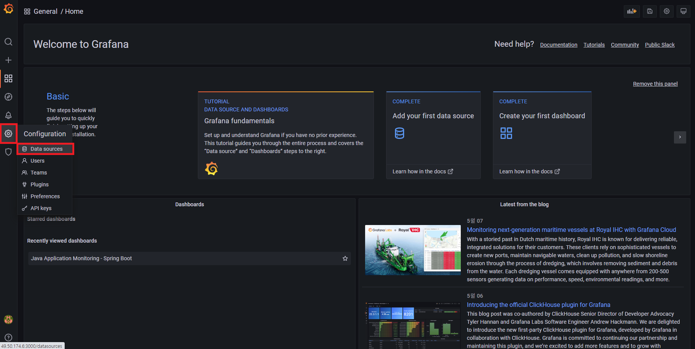

3. Add data source를 선택합니다.
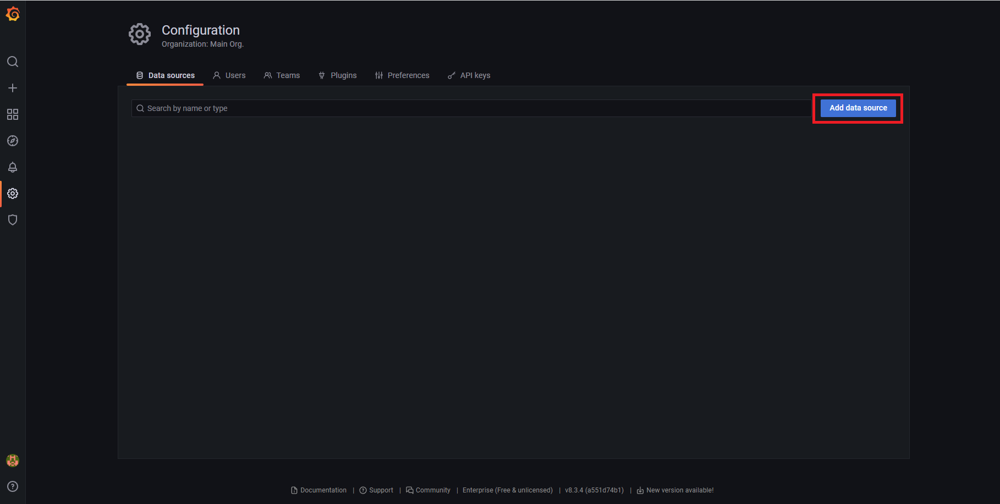

4. 프로메테우스를 선택 합니다.
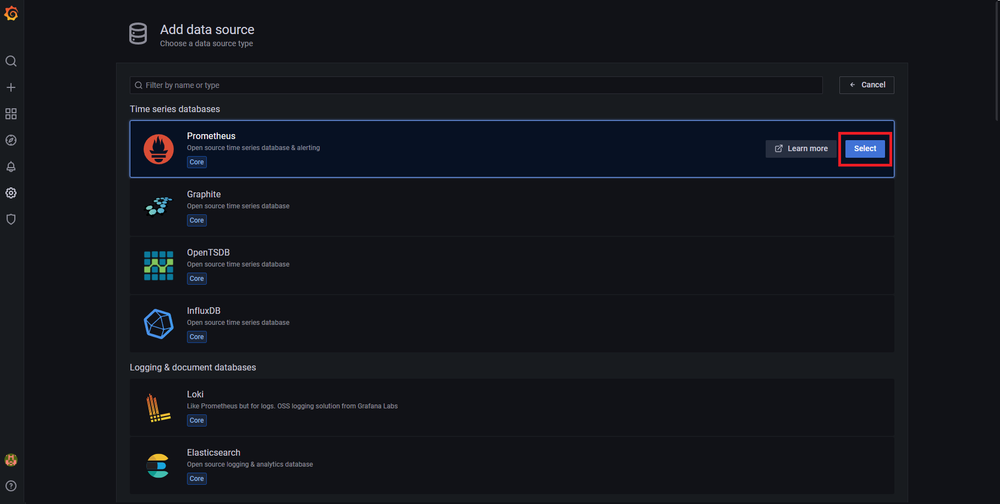

5. 프로메테우스 HTTP URI 를 입력합니다.(입력 예. http://localhost:9090 localhost인 이유는 동일한 서버에 존재하기 때문이다.)
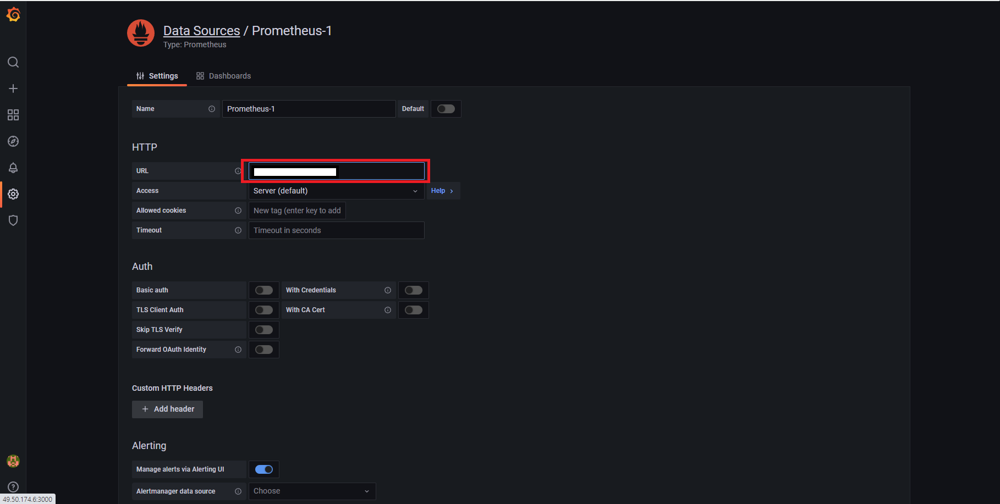

6. Save & test를 클릭합니다. 녹색 성공 창이 뜨면 됩니다.
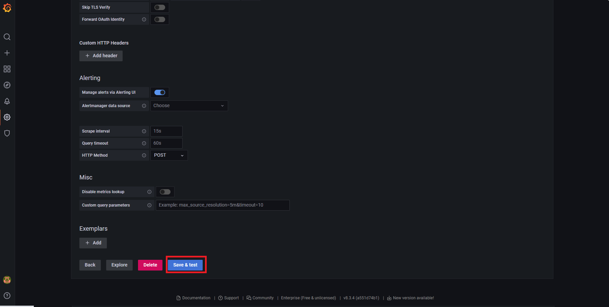

7. 왼쪽 메뉴의 +(Create) 클릭 > Import 를 선택합니다.
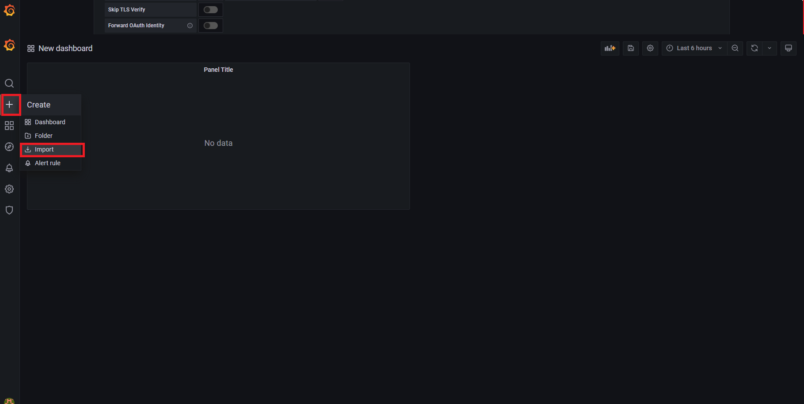

8. Upload JSON file 를 선택합니다. 그리고 /grafana-dashboard/ 폴더안에 있는 spring-boot.json, node-exporter-full_ver27.json, alarm.json(추후 그라파나 알람 추가) 을 추가합니다.
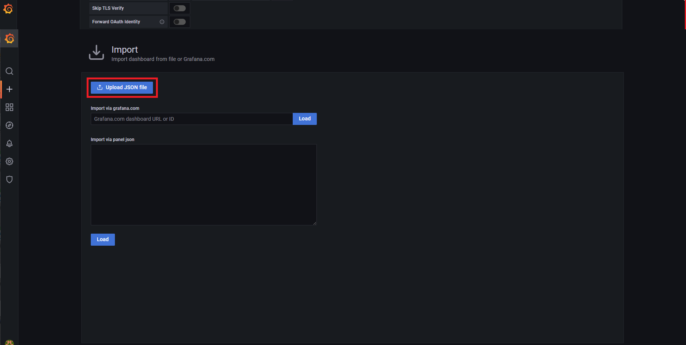

9. 추가 후 왼쪽메뉴의 돋보기 모양을 누른 후 Java Application Monitoring - Spring Boot 를 선택하면 Spring boot 어플리케이션을 모니터링 가능합니다.
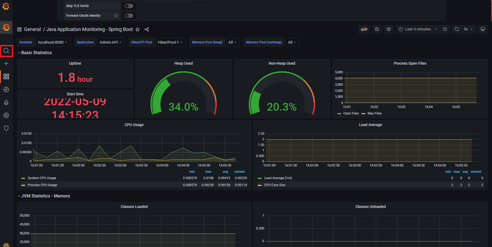

10. 마찬가지로 왼쪽메뉴의 돋보기 모양을 누른 후 Node Exporter Full 을 선택하면 리눅스 상태를 모니터링 가능합니다.
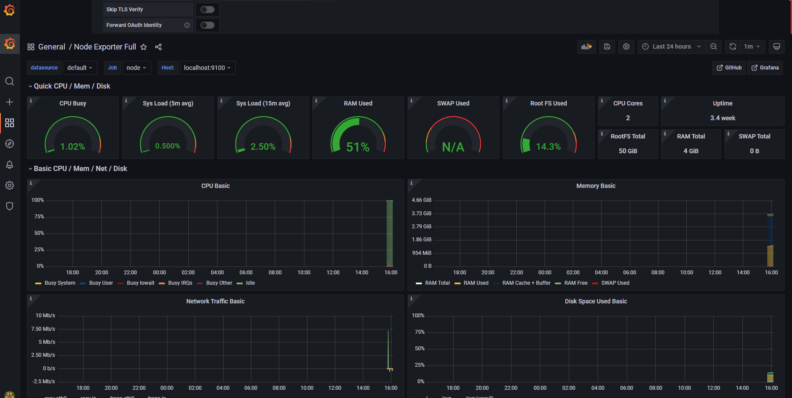

#### 그라파나 알람 연동
1. http://localhost:3000/ 접속하여 로그인을 합니다.

2. 왼쪽메뉴의 Alerting 메뉴 > Alert Rules 를 클릭합니다.
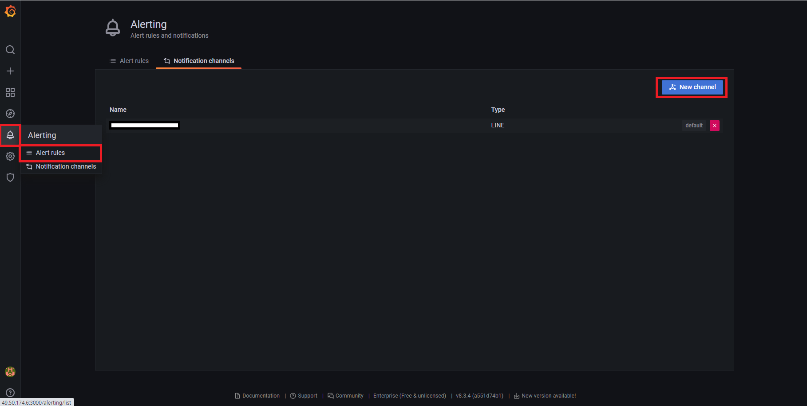

3. 라인 메신저로 알람을 보낼거기 때문에 Type을 LINE 로 변경합니다.
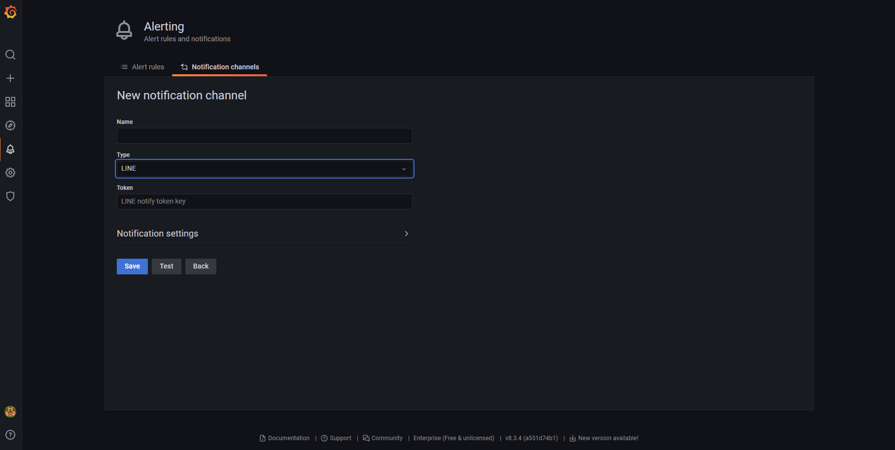

4. https://notify-bot.line.me/en/ 접속하여 라인 노티피케이션에 대한 토큰을 발급 받습니다.
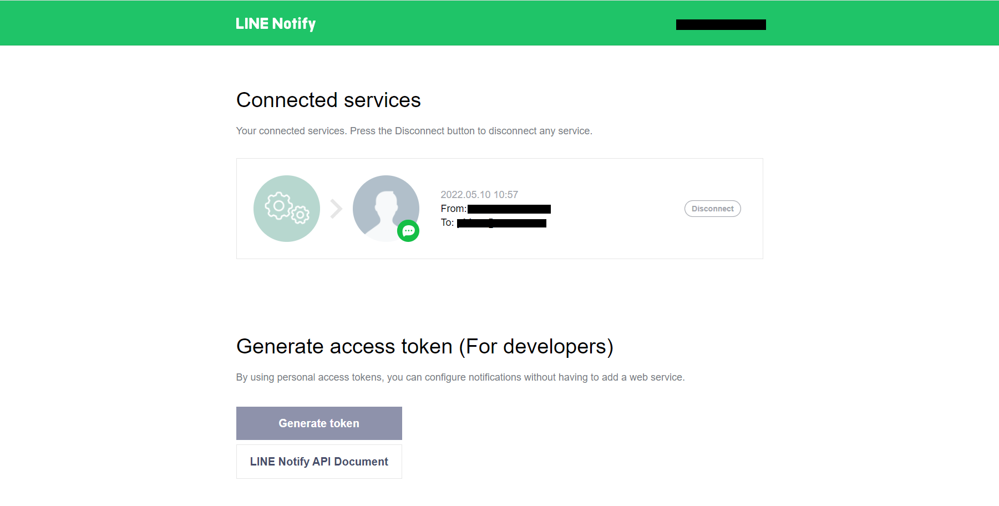

5. 그라파나 대시보드에 들어와서 패널의 수정 버튼을 클릭합니다.
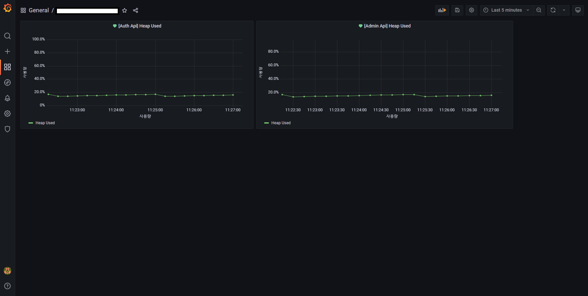

6. 알람에 대한 설정을 합니다.
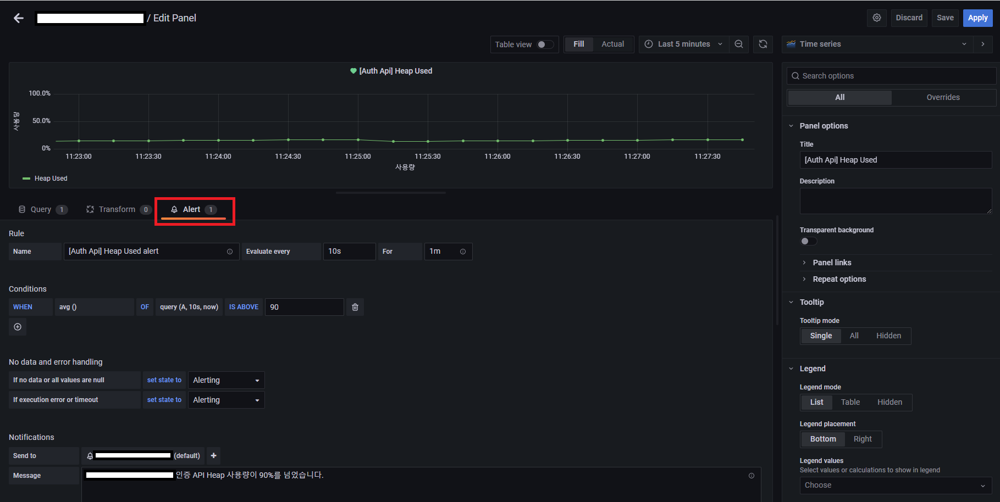

7. 알람 설정 값에 대한 설명입니다.
  - Rule
    - Name: Alert 발생시 나타낼 이름입니다.
    - Evaluate every: Alert 조건을 탐색하는 시간 주기입니다.
    - For: Alert 조건에 맞게 탐색이 될 때 발생조건이 유지되는 시간입니다. Alert 조건 일치시 해당 조건이 N분(초) 동안 유지되면 Alert 를 발생시킵니다.
  - Conditions
    - WHEN: 데이터 집계 방식을 설정하는 옵션입니다.
    - OF: 첫번째 인자는 Query 탭에서 설정한 Query 이름입니다. 2, 3번째 인자는 시간 범위를 나타내며 5m, now 인 경우 현재 시간부터 5분 전까지의 데이터를 탐색합니다.
    - IS ABOVE: 지정한 값보다 클 때의 조건입니다. 이 외에도 값이 작을 때, 일정 범위내에 있ㅇ르 때, 일점 범위를 벗어 날 때 등에 대한 옵션을 지정 할 수 있습니다.
  - Notifications
    - Send To: 알람을 보낼 Alerting 정보
    - Message: 알람을 보낼 메시지
  - No Data And Error Handling: Condition 에 설정한 조건으로 데이터 탐색시 데이터가 없거나 null인경우 혹은 쿼리 실행시 타임아웃 에러 발생에 대한 설정을 하는 옵션입니다.
    - No Data Option
      - NoData: No Data 상태 유지
      - Alerting: Alerting 발생
      - Keep Last State: 현재 alert rule 상태 유지
      - Ok: 정상 상태
    - Error or timeout Option
      - Alerting: Alerting 발생
      - Keep Last State: 현재 alert rule 상태 유지

8. 알람이 정상적으로 설정되었다면 Alerting 메뉴 > Alert Rules에서 확인 할 수 있습니다.
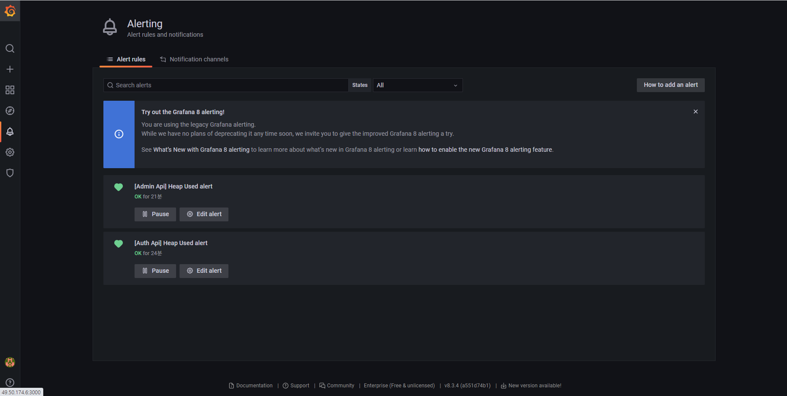