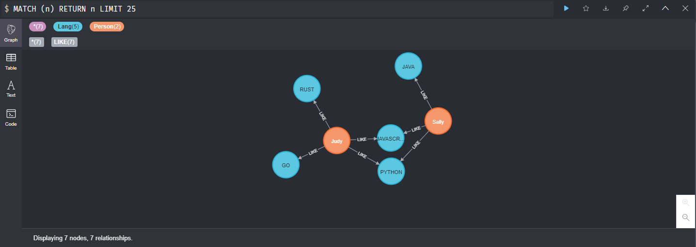

### Neo4j

#### 개요
- ACID 트랜잭션 지원
- Native 그래프 DB
- Cypher 쿼리 언어 제공
- 자바 기반의 그래프 DB로, 임베딩 방식과 REST 방식을 지원한다.
- 인덱스 및 노드 탐색을 지원한다.
- 이중화를 통한 고가용성을 지원한다.
- 백업/복구를 지원한다.
- 그래프 DB란? 데이터 간의 관계를 일급 엔티티로 다룰 수 있도록 설계된 데이터베이스이다.

#### 그래프 모델
- 노드(Node)
- 속성(Prpoertry): 노드 및 관계의 속성 값
- 관계(Edge): 단방향, 양방향
- 라벨(Label): 노드에 0개 또는 그 이상 존재한다. 노드에 라벨을 적용하면 노드를 그룹화 할 수 있다.


#### 그래프 데이터베이스 활용
- 이상탐지
- 추천엔진

#### Neo4j 브라우저
- 웹 기반 쉘 환경과 같은 명령 기반 클라이언트, 브라우저상에서 프로토타입을 손쉽게 만들 수 있다.
- Cypher를 활용한 그래프 쿼리 작성 및 실행
- 쿼리 결과 내보내기
- 노드 및 관계를 포함하는 쿼리 결과를 그래프로 시각화
- REST API를 편리하게 탐색

#### Cypher 
- 노드 생성
  - CREATE (sally:Person{name: 'Sally', age: 16})
  - CREATE (java:Lang{title: 'JAVA', authors: ['James Arthur Gosling']})
    - CREATE: 데이터 생성 구문
    - (): 노드 단위
    - {}: 속성 추가
    - java:Lang: 변수:라벨로 노드 구분
    - java:Lang :Object: 여러개의 라벨 지정
  - CREATE (sally)-[:Like]->(java)
    - []: 관계 설명

- 관계 지정
  - CREATE(n1)--(n2)
  - CREATE(n1)-->(n2)
  - CREATE(n1)<--(n2)
  - CREATE(n1)-[:타입명]->(n2)
  - CREATE(n1)-[변수명:타입명]->(n2)
  - CREATE(n1)-[변수명:타입명{속성키: "속성값", 속성키: "속성값"}]->(n2)
    - 방향의 관계를 지정 할 수 있다.
    - 관계에서도 속성을 지정 할 수 있다.
    - 타입명에는 대문자와 언더스코어(_)로 작성되며, 대소문자는 구별 된다. 하지만 하이픈(-)을 사요하면 안된다.
  - CREATE(n:Person{name: "Sally"})-[:KNOWS{since:2021}]->(m:Persion)
    - n은 변수명, Person은 노드 라벨, name은 속성 키, 값은 Sally
    - 엣지 타입은 KNOWS를 가지고, 속성으로는 since 2021을가진다.

- MATCH
  - MATCH (sally:Person) WHERE sally.name = "Sally" RETURN sally;
    - MATCH: 노드, 관계 패턴을 구체화 시켜주는 구문
    - (sally:Person): sally 라는 변수에 매칭되는 Person 라벵르 가진 단순 노드 패턴
    - WHERE: 결과에 제약하는 구문. 기존 RDBMS와 동일
    - sally.name: name 속성과 sally 값을 비교
    - RETURN: 특정 결과를 요청할 때 사용

- 예제

```
노드 생성
CREATE (sally:Person{name: 'Sally', age: 20})
CREATE (judy:Person{name: 'Judy', age: 25})
CREATE (java:Lang{title : 'JAVA', authors: ['James Arthur Gosling']})
CREATE (python:Lang{title : 'PYTHON', authors: ['Guido van Rossum']})
CREATE (javascript:Lang{title : 'JAVASCRIPT', authors: ['Brendan Eich']})
CREATE (rust:Lang{title : 'RUST', authors: ['호아레']})
CREATE (go:Lang{title : 'GO', authors: ['로버트 그리즈머 롭 파이크 켄 톰프슨']})

노드 관계 맺기
MATCH
  (a:Person),
  (b:Lang)
WHERE a.name = 'Sally' AND b.title = 'JAVA'
CREATE (a)-[r:LIKE]->(b)
RETURN type(r)

MATCH
  (a:Person),
  (b:Lang)
WHERE a.name = 'Sally' AND b.title = 'PYTHON'
CREATE (a)-[r:LIKE]->(b)
RETURN type(r)

MATCH
  (a:Person),
  (b:Lang)
WHERE a.name = 'Sally' AND b.title = 'JAVASCRIPT'
CREATE (a)-[r:LIKE]->(b)
RETURN type(r)

MATCH
  (a:Person),
  (b:Lang)
WHERE a.name = 'Judy' AND b.title = 'JAVASCRIPT'
CREATE (a)-[r:LIKE]->(b)
RETURN type(r)

MATCH
  (a:Person),
  (b:Lang)
WHERE a.name = 'Judy' AND b.title = 'PYTHON'
CREATE (a)-[r:LIKE]->(b)
RETURN type(r)

MATCH
  (a:Person),
  (b:Lang)
WHERE a.name = 'Judy' AND b.title = 'GO'
CREATE (a)-[r:LIKE]->(b)
RETURN type(r)
```

  - 결과
