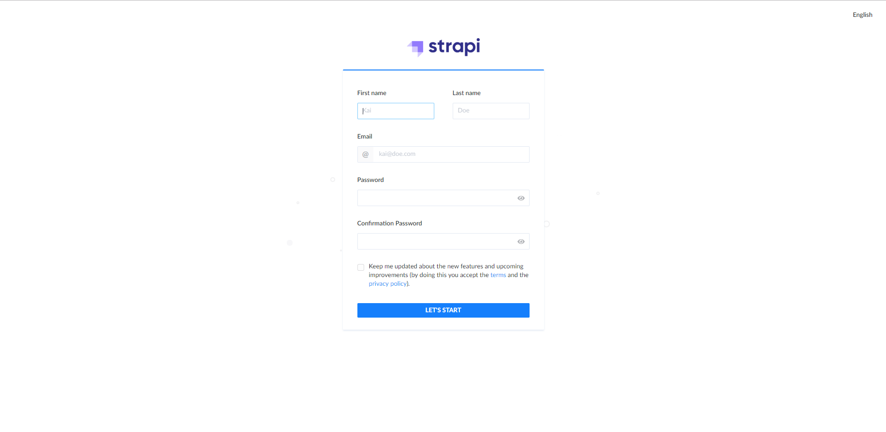
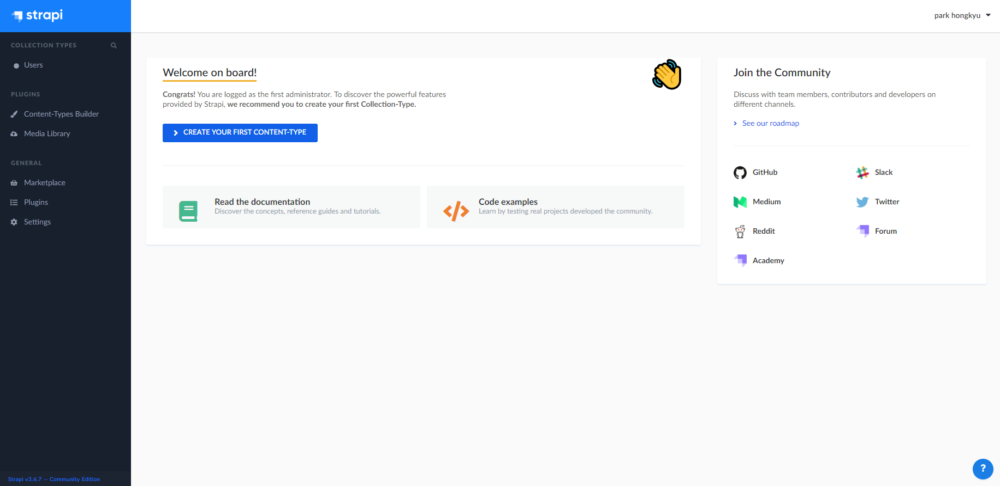
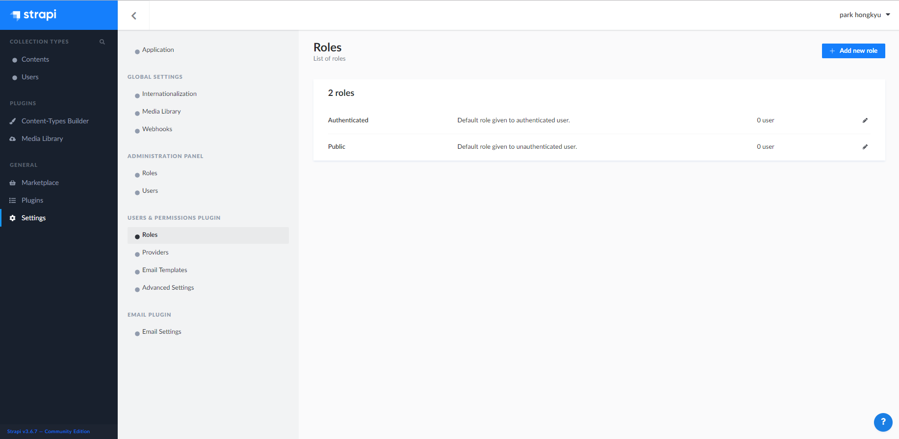
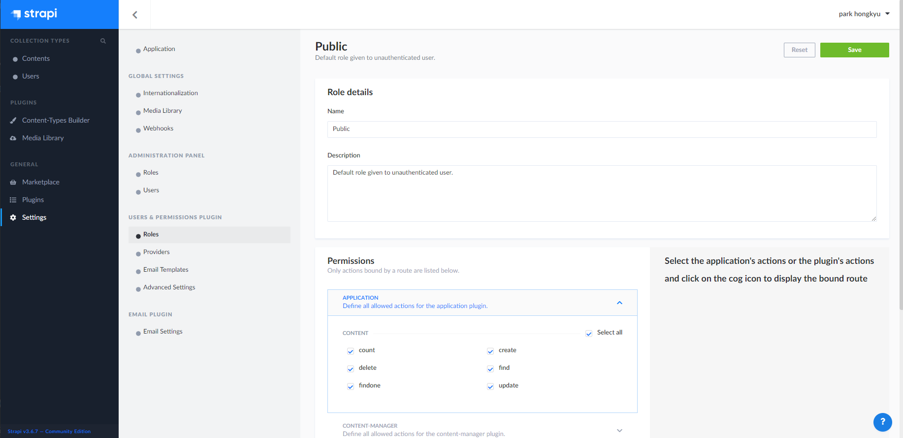
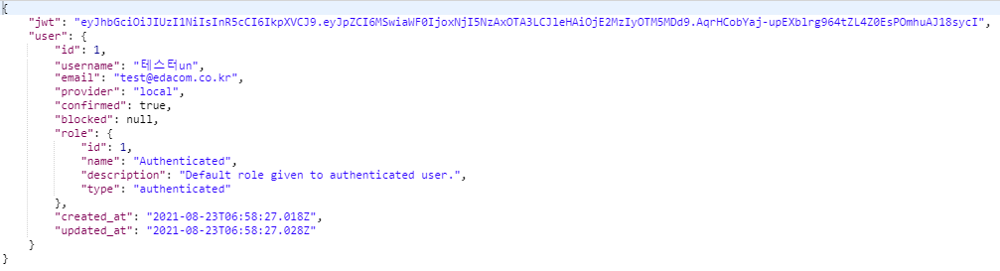
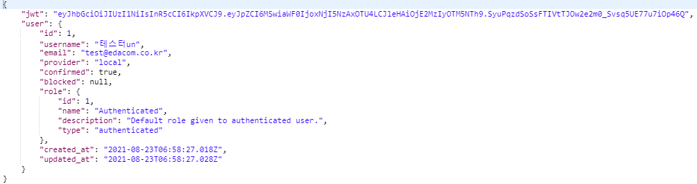
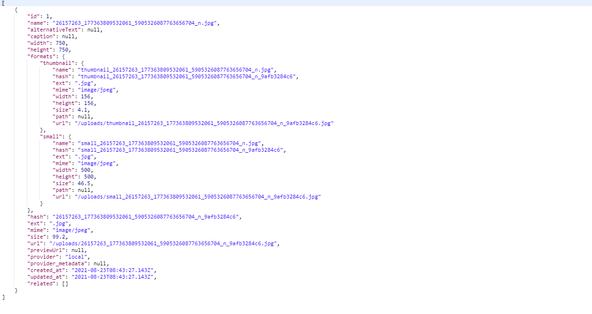

### Headless CMS란?
- 콘텐츠를 저장, 수정, 조회, 삭제만을 담당하고(RestAPI 형태로 존재), 콘텐츠 View에 대해서는 전혀 관혀를 하지 않는다.

### Strapi
- nodejs 기반의 Headless CMS 이다.
- Strapi는 View에 대한 지원이 거의 없기 때문에 DB 관리 및 생성, RestApi 관리 및 생성에만 집중되어있다.
- Strapi는 하나의 Table이 Content Type이라고 불리우며 각 Content Type 끼리 관계설정(1:1, 1:N, N:N...) 또한 매우 간단하다.

### 설치
1. Nodejs 를 설치를 한다.
2. NPX 를 설치 한다.

```
npm install -g npx
```

3. 아래의 커맨드를 입력하여 기본값 설정으로 Strapi 프로젝트를 생성한다.

```
npm create-strapi-app my-project --quickstart
```

4. 만약 위의 커맨드에서 --quickstart를 빼면 DB 설정 및 기타 설정을 따로 진행 할 수 있다. 하지만 위의 커맨드로 프로젝트를 생성 후 수정도 가능하다.

5. 설치 완료 후 my-project 폴더로 이동 후 아래 커맨드를 실행하면 실행이 된다. 관리자 접속 IP, Port는 커맨드 창에 출력이 된다.

```
npm run develop
```

6. 설치가 완료된 후 관리자에 접속 후 관리자 아이디 및 비밀번호를 생성하면 된다.


7. 아이디 및 비밀번호 생성 후 접속 하면 아래와 같은 화면이 나온다.


### 폴더 설명
- config: strapi의 설정 폴더
  - server.js: 서버 설정
  - database.js: DB 설정
  - functions
    - response
      - 404.js: 각 응답에 대한 커스텀 메시지를 작성
    - bootstrap.js: 서버가 실행하기전 실행할것이 있으면 실행하는 곳
    - cron.js: 스케줄러 실행 추가
- .cache: 관리자 패널을 구축하는데 사용되는 파일
- api: API 관련 파일 
  - config: API 관련 라우터 및 policies 등의 파일 설정
  - controllers: API 사용자 정의 컨트롤러
  - models: API 모델
  - services: API 사용자 정의 서비스
- build: 관리자 UI 빌드 파일
- extensions: 설치된 플로그인을 파일
- hooks: 사용자 정의 훅, 코어에 기능을 추가하는 모듈이다. 서버 부팅 중에 로드된다.
- middlewares: 사용자 정의 미들웨어, 요청에 따라 스택과 같은 방식으로 실행되는 기능이다.
- plugins: 로컬 플로그인, 관리자 패널에 통합 또는 자체 모델, 컨트롤러, 서비스, 미들웨어 또는 훅 로직을 구성 할 수 있다.
- public: 외부에서 엑세스 할 수 있는 파일

### Content-Type
- Collection Type
  - Database 에 Table을 생성하는 타입이다.
  - 생성하면 콘텐츠를 N 건을 삽입 할 수 있다.
  - 생성하면 기본 적으로 id(Auto Increment), published_at, created_by, updated_by, created_at, updated_at 필드가 생성이 된다.
- Single Type
  - Database 에 Table을 생성하는 타입이다.
  - 생성하면 콘텐츠를 1 건만 삽입 할 수 있다.
  - 생성하면 기본 적으로 id(Auto Increment), published_at, created_by, updated_by, created_at, updated_at 필드가 생성이 된다.
- Component
  - 레이아웃을 구성하는 타입

### 사용자 Role 설정 방법
1. 왼쪽 네비게이션 메뉴에서 General > Settings 접속한다

2. USERS & PERMISSIONS PLUGIN 메뉴 아래에 Roles 에 접속 한다.


3. Roles에서 권한을 변경 할 Roles를 선택한다.

4. 하단에 Permission에서 변경하면 된다.


### 회원가입 및 로그인
- 회원가입
  - URL: http://localhost:1337/auth/local/register
  - Method: POST
  - Request Body: 
    - password: 사용자 비밀번호
    - email: 사용자 이메일
    - username: 사용자 이름
  - Response Body: 사용자에 대한 전반적인 정보 반환
  

- 로그인
  - URL: http://localhost:1337/auth/local
  - Method: POST
  - Request Body: 
    - identifier: 사용자 이메일
    - password: 사용자 비밀번호
  - Response Body: 사용자에 대한 전반적인 정보 반환
  

  - 기타: 응답 받은 값에서 jwt 값을 API 통신시 Headers 의 Authorization 값에 Bearer 값에 넣어서 사용하면 된다.
  
- 회원 가입시 기본 Role 변경 방법
  1. General > Settings 메뉴로 이동한다.
  2. USERS & PERMMISSIONS PLUGIN > Advanced Settings 메뉴로 이동한다.
  3. Setting > Default role for authenticated users 값을 변경하고 Save 를 한다.

### 파일 업로드
- URL: http://localhost:1337/upload
- Method: POST
- Content-Type: multipart/form-data
- Request Param:
  - files: 파일(다중 업로드 가능)
- Response Body:

- 업로드한 파일 경로: my-project(생성한 프로젝트 폴더 명)/public/uplaods
- 접근 할 URL: http://localhost:1337/uploads/파일명.확장자
- 관리자에서 PLUGINS > Media Library 에서 접근 가능
- 파일 업로드시 권한이 없는 경우
  1. 관리자에서 GENERAL > Settings 메뉴 이동한다.
  2. USERS & PERMMISSIONS PLUGIN > Roles 메뉴로 이동한다.
  3. Roles 에서 해당하는 Role 을 선택한다.
  4. 하단 Permissions > UPLOAD 를 선택한다.
  5. upload 퍼미션을 주고 Save 를 한다.
- 기타: 파일 업로드는 파일업로드만, 엔트리(Collection Type, Single Type)에 파일 업로드 후 파일명 업데이트, 엔트리 + 파일 동시 업로드가 가능하다.([참고](https://strapi.io/documentation/developer-docs/latest/development/plugins/upload.html#upload-files))